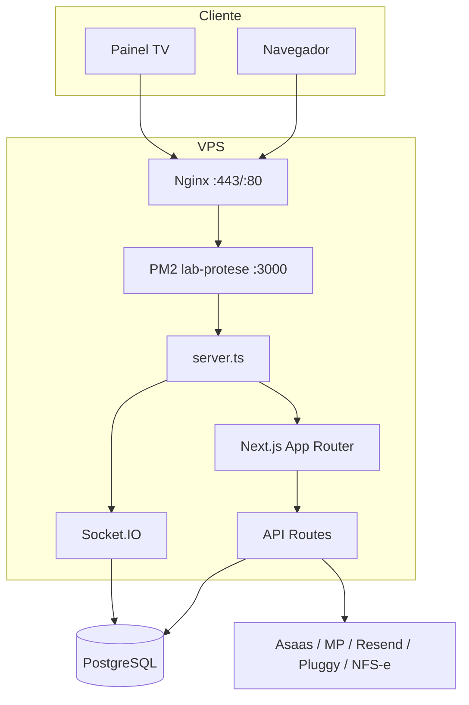
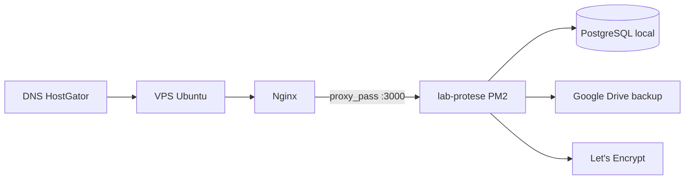
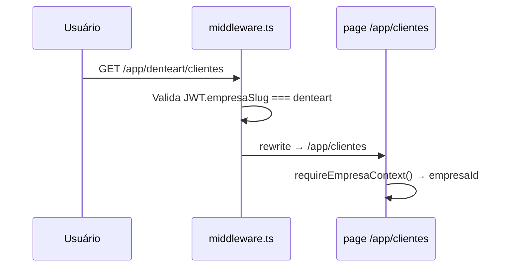
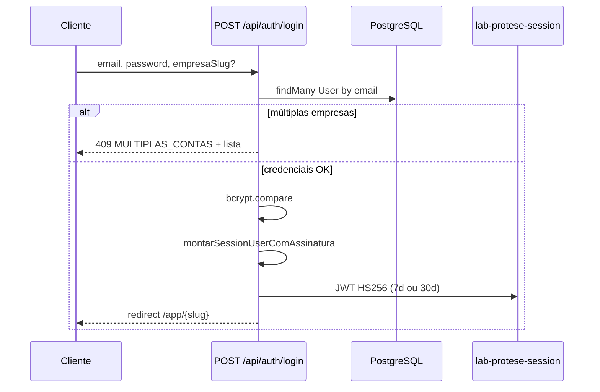
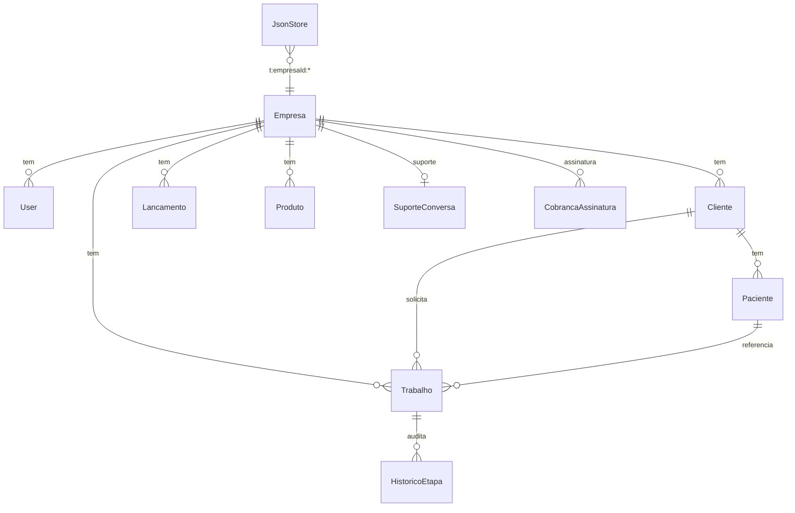
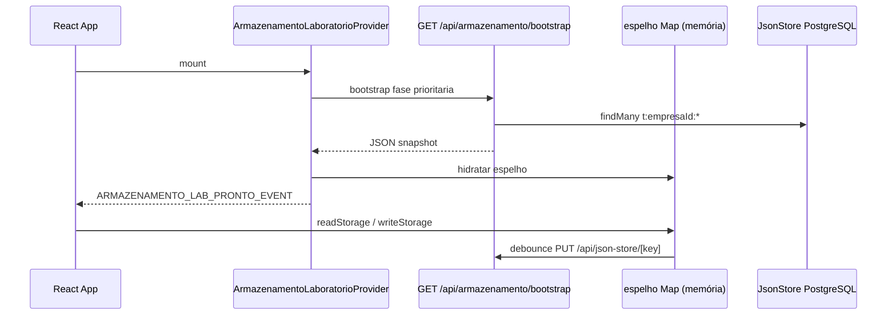
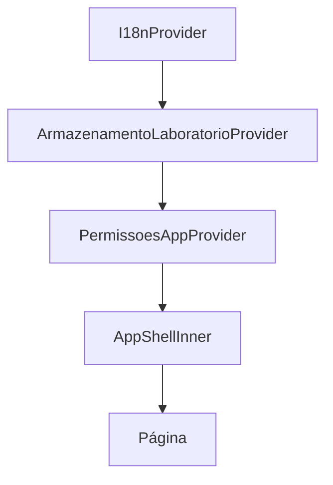
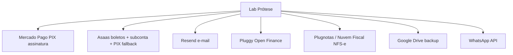
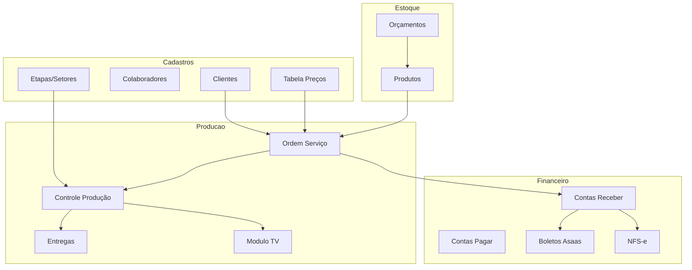

# SDD — Software Design Document

**Sistema:** Lab Prótese SaaS (DenteArt Lab)  
**Versão:** 1.0  
**Relacionado:** [PRD.md](./PRD.md)  
**Base:** implementação em `lab-protese-saas`  
**Última atualização:** junho/2026

---

## Índice

1. [Visão arquitetural](#1-visão-arquitetural)
2. [Stack e dependências](#2-stack-e-dependências)
3. [Topologia de deploy](#3-topologia-de-deploy)
4. [Camadas da aplicação](#4-camadas-da-aplicação)
5. [Multi-tenant](#5-multi-tenant)
6. [Autenticação e autorização](#6-autenticação-e-autorização)
7. [Modelo de dados](#7-modelo-de-dados)
8. [Armazenamento híbrido (Prisma + JsonStore)](#8-armazenamento-híbrido-prisma--jsonstore)
9. [Fluxo de requisições HTTP](#9-fluxo-de-requisições-http)
10. [Design das APIs](#10-design-das-apis)
11. [Tempo real (Socket.IO)](#11-tempo-real-socketio)
12. [Frontend e estado cliente](#12-frontend-e-estado-cliente)
13. [Geração de documentos (PDF/HTML)](#13-geração-de-documentos-pdfhtml)
14. [Jobs em background](#14-jobs-em-background)
15. [Integrações externas](#15-integrações-externas)
16. [Assinatura e billing](#16-assinatura-e-billing)
17. [Segurança](#17-segurança)
18. [Observabilidade e resiliência](#18-observabilidade-e-resiliência)
19. [Decisões de design (ADRs resumidas)](#19-decisões-de-design-adrs-resumidas)
20. [Referência de arquivos](#20-referência-de-arquivos)

---

## 1. Visão arquitetural

O sistema é um **monólito modular** em Next.js 15 com servidor HTTP customizado que embute:

- **App Router** (SSR/CSR híbrido)
- **API Routes** REST-like
- **Socket.IO** no mesmo processo Node

Não há microsserviços separados em produção: uma instância PM2 atende HTTP, APIs e WebSocket.



### Princípios

| Princípio | Implementação |
|-----------|---------------|
| Multi-tenant por linha | `empresaId` em entidades Prisma |
| Config flexível por tenant | `JsonStore` com prefixo `t:{empresaId}:` |
| Sessão stateless | JWT em cookie httpOnly |
| Lógica de negócio em libs | `src/lib/*` reutilizável por APIs e componentes |
| Tempo real colocalizado | Socket.IO no `server.ts`, não em serviço separado |

---

## 2. Stack e dependências

| Camada | Tecnologia | Versão ref. |
|--------|------------|-------------|
| Runtime | Node.js | 20 LTS |
| Framework | Next.js | 15 |
| UI | React | 19 |
| Linguagem | TypeScript | 5.x |
| ORM | Prisma | 6 |
| Banco | PostgreSQL | 14+ |
| Estilo | Tailwind CSS | 3/4 |
| Validação API | Zod | — |
| Auth token | jose (JWT HS256) | — |
| Senha | bcryptjs | — |
| PDF | jsPDF | — |
| Realtime | socket.io | — |
| Forms | react-hook-form | — |
| Cache cliente | TanStack Query | — |

**Entrypoint de produção:** `npm run start` → `server.ts` → `.next/dev-server.cjs`  
**Não usar em produção:** `next start` (quebra Socket.IO e jobs do servidor).

---

## 3. Topologia de deploy



| Componente | Configuração |
|------------|--------------|
| **Nginx** | `deploy/nginx-denteartlab.conf` — gzip, SSL, WebSocket upgrade |
| **PM2** | `deploy/ecosystem.config.cjs` — fork, 4GB heap, autorestart |
| **SSL** | Let's Encrypt; renovação: `deploy/garantir-renovacao-ssl.sh` |
| **App path** | `/opt/lab-protese-saas` |
| **Deploy** | `deploy/atualizar-producao.sh`, `deploy/deploy-vps-local.sh` |

Variáveis críticas: `DATABASE_URL`, `JWT_SECRET`, `URL_PUBLICA_DO_APP`, `COOKIE_SECURE=true` (HTTPS).

---

## 4. Camadas da aplicação

```
┌─────────────────────────────────────────────────────────┐
│  src/app/**/page.tsx          (páginas / rotas)         │
│  src/components/**            (UI reutilizável)         │
├─────────────────────────────────────────────────────────┤
│  src/app/api/**/route.ts      (handlers HTTP)           │
│  src/middleware.ts            (auth, slug, assinatura)  │
├─────────────────────────────────────────────────────────┤
│  src/lib/**                   (domínio, integrações)    │
├─────────────────────────────────────────────────────────┤
│  prisma/schema.prisma         (modelo relacional)       │
│  server.ts                    (HTTP + Socket.IO + jobs) │
└─────────────────────────────────────────────────────────┘
```

### Organização de `src/lib`

| Prefixo / pasta | Responsabilidade |
|-----------------|------------------|
| `*-servidor.ts` | Lógica só servidor (Prisma, secrets) |
| `auth*.ts`, `empresa-context.ts` | Sessão e tenant |
| `armazenamento-laboratorio.ts` | Espelho cliente do JsonStore |
| `json-store-tenant.ts` | CRUD JsonStore por empresa |
| `relatorio-*.ts`, `pdf-*.ts` | Relatórios e impressão |
| `asaas-*`, `mercadopago-*` | Pagamentos |
| `nfse/` | Emissão fiscal |
| `tv/` | Painel TV e eventos socket |
| `suporte/` | Chat master ↔ laboratório |
| `permissoes-*`, `usuarios-*` | RBAC |

---

## 5. Multi-tenant

### 5.1 Entidade raiz

`Empresa` é o tenant. Campos relevantes:

- `slug` — identificador na URL (`/app/denteart/financeiro`)
- `plano`, `limiteUsuarios`, `limiteTrabalhos`, `dataVencimento`, `status`
- `asaasCustomerIdPlataforma` — cobrança SaaS

### 5.2 Roteamento por slug



**Arquivos:** `src/lib/rotas-app.ts`, `src/middleware.ts`

| URL pública | Rota interna Next |
|-------------|-------------------|
| `/app/{slug}/clientes` | `/app/clientes` |
| `/app/financeiro` (legado) | redirect → `/app/{slug}/financeiro` |

Rotas legadas sem slug (`ROTAS_APP_SEM_SLUG`) são redirecionadas para incluir o slug da sessão.

### 5.3 Isolamento de dados

Toda query de API autenticada usa `empresaId` do contexto:

```typescript
// Padrão em route handlers
const ctx = await requireEmpresaContext();
const filtro = { empresaId: ctx.empresaId };
await prisma.trabalho.findMany({ where: filtro });
```

JsonStore usa chave `t:{empresaId}:{chaveBase}` (`json-store-tenant.ts`).

---

## 6. Autenticação e autorização

### 6.1 Fluxo de login



### 6.2 Payload JWT (tenant)

```typescript
{
  id: string;           // userId
  name, email, role: string;
  empresaId?: string;
  empresaSlug?: string;
  empresaNome?: string;
  assinaturaVencida?: boolean;
  exp: number;
}
```

Cookies: `lab-protese-session` (tenant), `lab-protese-master-session` (plataforma).

### 6.3 Middleware (Edge)

`src/middleware.ts` executa antes das rotas:

1. Redirect apex → `www` (produção)
2. Libera rotas públicas (login, cadastro, webhooks, tokens públicos)
3. Valida JWT (decode leve no Edge, sem `jose`)
4. Bloqueia `/app` se `assinaturaVencida`
5. Reescreve `/app/{slug}/...` → `/app/...`
6. Protege `/admin-master` com cookie master

### 6.4 Contexto de API

| Função | Uso |
|--------|-----|
| `getSession()` | Server Components |
| `requireEmpresaContext()` | APIs do laboratório |
| `requireEmpresaContextRenovacao()` | PIX assinatura com conta vencida |
| `requireSession()` | Força autenticação |

`empresa-context.ts` revalida usuário/empresa no banco e atualiza cookie se dados mudaram.

### 6.5 RBAC (autorização UI)

- Papéis: `proprietario`, `gerente`, `usuario`, `financeiro`, `producao`
- `permissoesJson` por item de menu: `ver | criar | editar | excluir`
- Filtro por `setores[]` no módulo produção
- `PermissoesAppProvider` + `podeVerHref()` no shell
- Proprietário: acesso total automático

**Arquivos:** `usuarios-sistema.ts`, `usuarios-menu-permissoes.ts`, `permissoes-acesso.ts`

---

## 7. Modelo de dados

### 7.1 Diagrama relacional (simplificado)



### 7.2 Entidades Prisma principais

| Modelo | Propósito |
|--------|-----------|
| `Empresa` | Tenant, plano, vencimento |
| `User` | Usuário do laboratório |
| `Cliente`, `Paciente` | CRM |
| `Trabalho` | Ordem de serviço |
| `HistoricoEtapa` | Auditoria de produção |
| `Lancamento` | Receitas/despesas |
| `ContaBancaria`, `MovimentacaoConta` | Banco |
| `CobrancaAsaas` | Boletos do lab |
| `NfseEmissao` | Notas fiscais |
| `Produto`, `Orcamento` | Estoque |
| `ArquivoUpload` | Anexos binários |
| `JsonStore` | KV JSON por tenant |
| `CobrancaAssinatura` | PIX da plataforma |
| `MasterUser`, `MasterAuditLog` | Admin plataforma |
| `SuporteConversa`, `SuporteMensagem` | Chat suporte |
| `SequenciaNumerica` | Numeração OS, etc. |

### 7.3 Sequenciamento

`SequenciaNumerica` + `os-sequencia.ts` garantem `numeroOs` único por empresa.

---

## 8. Armazenamento híbrido (Prisma + JsonStore)

### 8.1 Por que híbrido?

| Tipo | Onde | Exemplos |
|------|------|----------|
| **Relacional** | Tabelas Prisma | OS, clientes, lançamentos, produtos |
| **Documento JSON** | `JsonStore` | Colaboradores, etapas, setores, configs, plano de contas padrão |

Cadastros operacionais e configurações mudam com frequência e têm estrutura flexível — ficam no JsonStore para evitar migrações constantes.

### 8.2 Fluxo bootstrap cliente



**Arquivos:** `armazenamento-laboratorio.ts`, `ArmazenamentoLaboratorioProvider.tsx`, `api/armazenamento/bootstrap`

### 8.3 Chaves JsonStore (exemplos)

Prefixo tenant: `t:{empresaId}:labProteseConfigLaboratorio`

Lista completa: `armazenamento-laboratorio-keys.ts`

### 8.4 Fases de bootstrap

| Fase | Conteúdo |
|------|----------|
| `prioritaria` | Config essencial para primeira tela |
| `complementar` | Dados secundários (adiado) |
| `completa` | Full sync |

Cache servidor: `bootstrap-cache.ts` invalidado em writes.

---

## 9. Fluxo de requisições HTTP

### 9.1 Página autenticada

```
Browser → Nginx → server.ts → Next.js
  → middleware (auth, slug rewrite)
  → layout app (AppShell)
  → ArmazenamentoLaboratorioProvider (bootstrap)
  → page.tsx (client/server components)
  → fetch /api/* com cookies
```

### 9.2 API autenticada

```
route.ts
  → requireEmpresaContext()
  → Zod parse body/query
  → prisma / lib de domínio
  → side effects (TV notify, auditoria, socket)
  → NextResponse.json
```

### 9.3 Rotas públicas (sem sessão)

| Padrão | Exemplo |
|--------|---------|
| Token na URL | `/acompanhamento/[token]` |
| API pública | `/api/clientes/public/[token]` |
| Webhook | `/api/asaas/webhook`, `/api/mercadopago/webhook` |
| Branding | `/api/lab/branding?slug=` |

---

## 10. Design das APIs

### 10.1 Convenções

| Aspecto | Padrão |
|---------|--------|
| Formato | JSON |
| Erros | `{ error: string }` + HTTP 4xx/5xx |
| Auth | Cookie automático (`credentials: same-origin`) |
| Validação | Zod schemas por rota |
| Tenant | Sempre via `requireEmpresaContext()`, nunca confiar em `empresaId` do body |
| Cache | `Cache-Control: no-store` em APIs autenticadas |

### 10.2 Grupos de endpoints

| Prefixo | Operações |
|---------|-----------|
| `/api/trabalhos` | CRUD OS, busca, impressão |
| `/api/clientes` | CRUD, import, público |
| `/api/financeiro` | Lançamentos, faturas, extratos |
| `/api/produtos` | Estoque |
| `/api/dashboard` | Agregações painel inicial |
| `/api/relatorios/*` | Dados para relatórios |
| `/api/backup/*` | Export/import |
| `/api/assinatura/*` | PIX renovação |
| `/api/admin-master/*` | Gestão plataforma |
| `/api/tv/*` | Snapshot ordens TV |

### 10.3 Efeitos colaterais comuns

Após mutações em `Trabalho`:

```typescript
await registrarLogAuditoria(...);
void notificarTvOrdensEmpresa(empresaId);
```

---

## 11. Tempo real (Socket.IO)

### 11.1 Configuração

| Parâmetro | Valor |
|-----------|-------|
| Path | `/api/tv/socket.io` |
| Servidor | `server.ts` (mesmo HTTP server) |
| Transports | polling, websocket |
| Auth | Cookie `lab-protese-session` no handshake |

Nginx deve fazer upgrade WebSocket para este path.

### 11.2 Salas e eventos

| Sala | Padrão | Uso |
|------|--------|-----|
| TV | `tv:empresa:{empresaId}` | Painel chão de fábrica |
| Suporte lab | `suporte:empresa:{empresaId}` | Chat tenant |
| Suporte master | `suporte:master` | Painel admin |

**Eventos TV (servidor → cliente):**

- `tv:sync` — snapshot completo
- `tv:ordens:update`, `tv:ordem:nova`, `tv:ordem:moved`
- `tv:chart:update`

**Eventos suporte:** `suporte-socket-events.ts`

### 11.3 Store TV

`tv-ordens-store.ts` mantém snapshot em memória por empresa, refresh automático (~20s) e emite via `setTvSocketIo(io)`.

### 11.4 Presença

`presenca-usuarios.ts` rastreia usuários online por empresa (socket.id) para exibir no painel TV.

---

## 12. Frontend e estado cliente

### 12.1 Shell da aplicação

`AppShell` (`app-shell.tsx`):

- Header com menu, notificações, configurações, perfil
- Nav desktop com dropdowns controlados (um aberto por vez)
- `AppMobileNav` — drawer mobile com grupos expansíveis
- Busca rápida OS (modal)
- Tema claro/escuro
- `I18nProvider` — PT/EN/ES

### 12.2 Providers globais



### 12.3 Padrões UI

- Componentes em `src/components/{modulo}/`
- Formulários grandes: modais dedicados (`LancarReceitaModal`, etc.)
- Selects com portal: `SelectPesquisavel`, `dropdown-portal-pos.ts` (corrige zoom global)
- Listagens: tabelas com filtros locais + fetch API

### 12.4 Sessão e inatividade

`use-sessao-inatividade.ts` — logout após período sem interação; chama `/api/auth/logout`.

---

## 13. Geração de documentos (PDF/HTML)

### 13.1 Pipeline

```mermaid
flowchart LR
  UI[Botão Imprimir] --> Prep[prepararAbaPdf]
  UI --> Gen[gerarRelatorioTabelaPdf / jsPDF]
  Gen --> Blob[Blob PDF]
  Blob --> Viewer[abrirPdfNoVisualizadorPagina]
  Viewer --> Page[/app/financeiro/relatorio-pdf]
  Page --> Sess[PdfViewerSession id]
```

### 13.2 Componentes

| Módulo | Função |
|--------|--------|
| `pdf-viewer.ts` | Abrir PDF/HTML em nova aba |
| `pdf-viewer-aba.ts` | Sessão viewer, postMessage entre abas |
| `pdf-relatorio-tabela.ts` | PDF tabular padrão |
| `relatorios-impressao-pdf.ts` | PDFs por relatório |
| `pdf-lab-cabecalho.ts` | Cabeçalho com logo do lab |

Rotas de impressão fullscreen ocultam menu do `AppShell` (path contém `/imprimir` ou `/relatorio-pdf`).

---

## 14. Jobs em background

Iniciados em `server.ts` após `listen()` (delay configurável, padrão 120s):

| Job | Arquivo | Frequência |
|-----|---------|------------|
| Backup automático | `backup-automatico.ts` | Diário (cron interno) |
| Limpeza contas inativas | `exclusao-empresa.ts` | Diário |
| Limpeza suporte inativo | `suporte-limpeza.ts` | Periódico |
| Refresh TV | `tv-ordens-store.ts` | ~20s |
| Manutenção servidor | `servidor-saude.ts` | Keepalive DB |
| Cron externo | `/api/cron/limpar-contas-inativas` | Via scheduler HTTP |

Backup: disco local → Google Drive → OneDrive (rclone opcional).

---

## 15. Integrações externas

### 15.1 Mapa de integrações



### 15.2 Webhooks

| Endpoint | Origem | Ação |
|----------|--------|------|
| `/api/mercadopago/webhook` | Mercado Pago | Confirma PIX assinatura |
| `/api/asaas/webhook` | Asaas | Assinatura + boletos + subconta |

Webhooks são públicos no middleware; validação de assinatura no handler.

### 15.3 Padrão de integração

1. Lib em `src/lib/{provedor}*.ts` — sem UI
2. API route fina — parse, auth, chama lib
3. Secrets só em `.env` (nunca client)
4. Idempotência em webhooks via IDs externos (`asaasPaymentId`, etc.)

---

## 16. Assinatura e billing

### 16.1 Estados da empresa

| status | dataVencimento | Comportamento |
|--------|----------------|---------------|
| `ativo` | futuro | Acesso normal |
| `ativo` | passado | `assinaturaVencida` no JWT → bloqueio `/app` |
| `bloqueado` | — | Sem acesso |
| `pendente` | — | Aguardando ativação |

### 16.2 Fluxo PIX

```
/assinatura-vencida → POST /api/assinatura/pix
  → Mercado Pago ou Asaas cria cobrança
  → CobrancaAssinatura (status pendente)
  → polling /pagamento OU webhook
  → atualiza dataVencimento Empresa
  → novo JWT sem assinaturaVencida
```

### 16.3 Limites por plano

Enforced em criação de usuários/OS (`master-planos.ts`, validações nas APIs).

---

## 17. Segurança

| Controle | Implementação |
|----------|---------------|
| HTTPS | Nginx + Let's Encrypt |
| Cookie | `httpOnly`, `secure` (prod), `sameSite: lax` |
| CSRF | SameSite + APIs JSON (sem cookie em third-party) |
| Tenant isolation | `empresaId` obrigatório em queries |
| Slug mismatch | Redirect forçado no middleware |
| Senha | bcrypt cost 10 |
| Tokens públicos | UUID/cuid em `tokenAcompanhamento`, URLs não adivinháveis |
| Master admin | Cookie e role separados |
| Uploads | Associados a `empresaId`; storage database |
| Headers | `X-Content-Type-Options: nosniff` |
| Sessão expirada | 401 → redirect login; bootstrap detecta 401 |

---

## 18. Observabilidade e resiliência

| Aspecto | Mecanismo |
|---------|-----------|
| Health | `GET /api/health`, `GET /api/tv/socket-health` |
| Version | `GET /api/version`, `NEXT_PUBLIC_APP_BUILD_ID` |
| Cache bust | `app-cache-recovery.ts` — detecta deploy novo |
| Bootstrap timeout | 20s com tela de erro + link limpar cache |
| PM2 | autorestart, max_memory_restart 3.6GB |
| DB warmup | `aquecerServidor()` no boot |
| Logs | `console.error` estruturado; auditoria em `LogAuditoria` |
| Ping externo | `deploy/ping-servidor.sh` (cron opcional) |

---

## 19. Decisões de design (ADRs resumidas)

| # | Decisão | Motivo | Trade-off |
|---|---------|--------|-----------|
| ADR-1 | Monólito Next + Socket.IO | Simplicidade deploy VPS | Escala vertical; sem horizontal fácil para WS |
| ADR-2 | JsonStore para configs | Flexibilidade sem migrations | Dados duplicados relacional vs JSON; sync cliente |
| ADR-3 | JWT em cookie vs localStorage | Segurança XSS | Requer HTTPS em prod |
| ADR-4 | Slug na URL + rewrite interno | URLs amigáveis multi-tenant | Complexidade no middleware |
| ADR-5 | `server.ts` customizado | TV + jobs + WS no mesmo processo | Build mais complexo que `next start` |
| ADR-6 | Assinatura no JWT | Bloqueio rápido no Edge | Precisa re-login após pagamento ou refresh sessão |
| ADR-7 | Mercado Pago > Asaas para PIX SaaS | Preferência configurável | Dois provedores para manter |

---

## 20. Referência de arquivos

| Área | Arquivos principais |
|------|---------------------|
| Servidor | `server.ts`, `deploy/ecosystem.config.cjs` |
| Middleware | `src/middleware.ts` |
| Auth | `src/lib/auth.ts`, `auth-token.ts`, `master-auth-token.ts` |
| Tenant | `src/lib/empresa-context.ts`, `rotas-app.ts` |
| Dados | `prisma/schema.prisma`, `src/lib/db.ts` |
| JsonStore | `json-store-tenant.ts`, `armazenamento-laboratorio.ts` |
| Permissões | `permissoes-acesso.ts`, `usuarios-sistema.ts` |
| TV | `src/lib/tv/*` |
| Suporte | `src/lib/suporte/*` |
| PDF | `src/lib/pdf-viewer.ts`, `pdf-relatorio-tabela.ts` |
| Deploy | `deploy/VPS-UBUNTU.md`, `nginx-denteartlab.conf` |
| Produto | `docs/PRD.md` |

---

## Diagrama de módulos de negócio



---

*Documento derivado do código-fonte. Atualize quando houver mudanças em `server.ts`, `middleware.ts`, `schema.prisma` ou padrões de API.*
